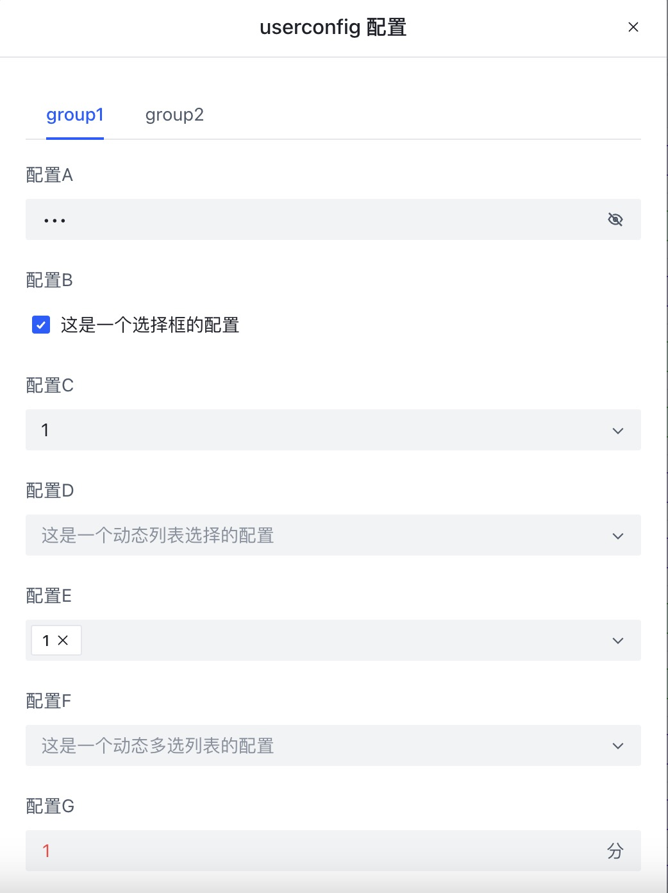

# 用户配置

`==UserConfig==` 中的内容,应该在`==UserScript==` 后方,表示脚本的一些用户配置.配置信息的描述使用[yaml](https://yaml.org/)格式来进行编写:

```js
/* ==UserConfig==
group1:
  configA:                                # 键值为group.config,例如本键为:group1.configA
    title: 配置A                          # 配置的标题
    description: 这是一个文本类型的配置     # 配置的描述内容
    type: text                            # 选项类型,如果不填写会根据数据自动识别
    default: 默认值                       # 配置的默认值
    min: 2                                # 文本最短2个字符
    max: 18                               # 文本最长18个字符
    password: true                        # 设置为密码
  configB:
    title: 配置B
    description: 这是一个选择框的配置
    type: checkbox
    default: true
  configC:
    title: 配置C
    description: 这是一个列表选择的配置
    type: select
    default: 1
    values: [1,2,3,4,5]
  configD:
    title: 配置D
    description: 这是一个动态列表选择的配置
    type: select
    bind: $cookies                       # 动态显示绑定的values,值是以$开头的key,value需要是一个数组
  configE:
    title: 配置E
    description: 这是一个多选列表的配置
    type: mult-select
    default: [1]
    values: [1,2,3,4,5]
  configF:
    title: 配置F
    description: 这是一个动态多选列表的配置
    type: mult-select
    bind: $cookies
  configG:
    title: 配置G
    description: 这是一个数字的配置
    type: number
    default: 1
    min: 10  # 最小值
    max: 16  # 最大值
    unit: 分 # 表示单位
---
group2:
  configX:
    title: 配置A
    description: 这是一个文本类型的配置
    default: 默认值
 ==/UserConfig== */
```

在此处定义完成后,将会在控制面板中显示配置按钮,供用户配置,开发者使用`GM_getValue`获取配置的值,key使用`group.config`来表示.

